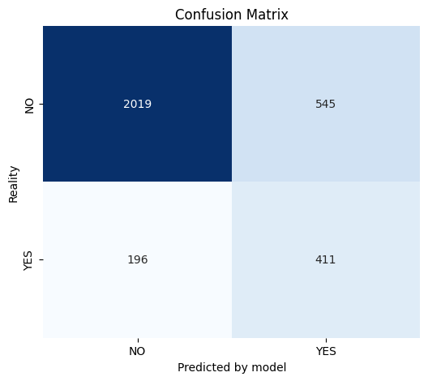

# Newspaper Subscriber Prediction

## Project Overview
This project focuses on building a machine learning pipeline to predict the subscription status of newspaper customers (Binary Classification). The goal is to identify patterns determining whether a customer remains a subscriber based on demographic, financial, and behavioral data.

The workflow includes data cleaning, handling missing values, feature engineering, encoding, model training, hyperparameter tuning, and evaluation.

## Assignment Details
* **Dataset:** Dataset ID 4 - NewspaperChurn.
* **Model:** Model ID 3 - Support Vector Machine (SVM).

Dataset contains 15,855 rows and 19 columns.

## Key Findings & Methodology
1.  **Dataset Imbalance:** Approximately 19% of customers are active subscribers (Target Class 1).
2.  **Hidden features in Deliveryperiod:**
    * Unified inconsistent labels in `Deliveryperiod` (e.g., merging variations of "Thu-Sun").
    * Specific suffixes like **"T"** (likely Trial) and **"OL"** (likely Online) were extracted.
    * **Insight:** 100% of users with the "T" flag and ~99.5% of users with the "OL" flag are NOT subscribers.
3.  **Correlations:**
    * Older customers (`Age`) and those with longer residence (`Year Of Residence`) are more likely to be subscribers.
    * Positive `reward program` usage correlates with lower resignation risk.
4.  **Data Splitting:** Applied stratified split (`stratify=y`) during the train-test split to ensure the minority class distribution (19%) remains consistent in both training and evaluation sets.
5.  **Encoding:** Used `WOEEncoder` for features with many unique values (`City`, `Ethnicity`) to capture target information better than standard encoding.
6.  **Classifier:** `SVC` (Support Vector Classifier) with `class_weight='balanced'` to handle the 19% minority class.
7.  **Hyperparameter Tuning:** Optimized using **RandomizedSearchCV** (5-fold cross-validation) maximizing the **F1-score**.
    * **Best Parameters:** Kernel: `rbf`, C: `1`, Gamma: `scale`, Features: `all`.

## Final Results & Metrics

The model was evaluated on a held-out test set (20% split). Given the class imbalance, **F1-Score** and **ROC AUC** are the primary metrics for evaluation.

| Metric | Score | Interpretation |
| :--- | :--- | :--- |
| **ROC AUC** | 0.8158 | Indicates the model has a strong ability to distinguish between subscribers and non-subscribers. |
| **F1-Score (Class 1)**| 0.5323 | A balanced measure of precision and recall for the minority class. |
| **Recall (Class 1)** | 0.6919 | The model successfully identifies 69% of the target cases. |
| Accuracy | 0.7673 | Lower than the majority baseline due to the trade-off made to capture the minority class. |

The model prioritizes finding the minority class, which is often the desired strategy in churn prediction to avoid missing customers.

### Confusion Matrix

* **True Positives (420):** Correctly identified subscribers.
* **False Negatives (187):** Subscribers missed by the model.

**Summary:** The model prioritizes finding the minority class, which is the desired strategy to minimize churn.
